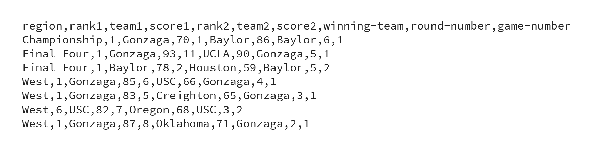

# NCAA-March-Madness
 
A C++ program that reads in and analyzes data from the NCAA Basketball Tournaments (March Madness) spanning 2021–2022. 

It displays the path taken to the championship, determines which region is expected to win at a given round, and you can also compare the actual brackets to your own predictions! The hierarchy of the brackets is implemented via linked lists to evaluate the resulting brackets if earlier games had a different outcome. Other menu options are listed below.

CSV data files for the following three tournaments are provided: 2021 Men’s, 2022 Men’s, 2022 Women’s. Four CSV files with prediction data for these tournaments are also provided. Each file is sorted in the following order: Championship game, Final Four games, games of each region. Within each region, the games are sorted and grouped by round number. 

Users can also upload and use their own prediction files, provided they are formatted and ordered the same as the tournament files and the Round 1 teams match the Round 1 teams in the tournament data, i.e., the initial brackets are the same.

The following is a sample of data displayed in .csv:

 
*Note:* The prediction files do not have any scores, because the relevant information is what the user predicts the winner of each game to be.

*Note:* In the 2021 Men's Tournament, scores for round 1, game 7 of Oregon vs VCU are blank. This game was cancelled due to COVID-19 precautions, and Oregon moved on. The program reads in and handles such values differently.

The user can choose which NCAA Tournament data to analyze. Once the data is read from the file, the following menu options for analysis will be displayed:

- **Menu Option 1** – Display the following general information about the dataset that has been read in:
  - The total number of games in the tournament
  - The Final Four contestants and the region they come from, in the same order the regions are listed in the file. It is safe to assume that there are always 4 regions.
  
- **Menu Option 2** – Select a game by round number and winning team and view its sub-brackets. The input is case-sensitive, e.g., "notre dame" will not match any games, but "Notre Dame" should.

- **Menu Option 3** – Display the path that the winning team took to the championship and the games played along the way. The games are displayed in the order in which they are played, i.e., starting at Round 1 up to and including the final championship game.

- **Menu Option 4** – Determine which region is expected to win the championship based on a given round from Round 2 up to Round 5 (the Final Four).

If Round 5 (the Final Four) is selected, the region expected to win the championship is the region that sent the best ranking team to the Final Four. Note that within each region, teams are ranked 1-16. A rank of 1 indicates that this is the best team in the region, and a rank of 16 indicates that it is the worst team in the region.

For Rounds 2-4, the region expected to win the championship is the one that has the best ranking teams that won games in that round. The program evaluates the games from the selected round and adds up the ranks of the teams that won games in that round. The region with the lowest total is the one expected to win the championship. 

In the case of a tie, the region displayed is the first region in the order they are listed in the file.

- **Menu Option 5** – Identify the best underdog within a given round from Round 2 up to Round 6 (the Championship). The worst ranking team is found among those games and displayed. It is considered the best underdog because this team is supposedly the worst among the teams that made it to the round chosen. Note that within each region, teams are ranked 1-16; a rank of 1 indicates that this is the best team in the region, and a rank of 16 indicates that it is the worst team in the region.

- **Menu Option 6** – Find the shoo-in and nail-biting games in the overall tournament (user input: 7) or within a given round from Round 1 up to Round 6 (the Championship). The shoo-in game is the one with the greatest difference in scores, perhaps indicating that it was easy for the winning team. The nail-biting game is the one with the smallest difference in scores, or the closest game. If there is a tie, the first game in the file that had this greatest or smallest difference in scores is displayed.

- **Menu Option 7** – Compute the number of winners predicted correctly by comparing the actual tournament brackets to the user-provided NCAA Tournament bracket predictions. For each winner predicted correctly, the round number of the game is multiplied by 5 and added onto the total score. If the user's score is greater than or equal to 250, a congratulatory message is displayed.

- **Menu Option 8** – "Undo" the championship game for a chosen number of rounds. The program modifies the brackets to reflect what would happen if the winner was the other team in the number of rounds selected, working backwards from the championship. Once the brackets have been modified, the new path to the championship is displayed. The modified brackets are then used for the rest of the program execution.

- **Menu Option 9** – Exit the program.

*Note:* A diagram of the sub-brackets for the 2022 Men’s Tournament is included in the repository and can be used to better understand the program execution.
